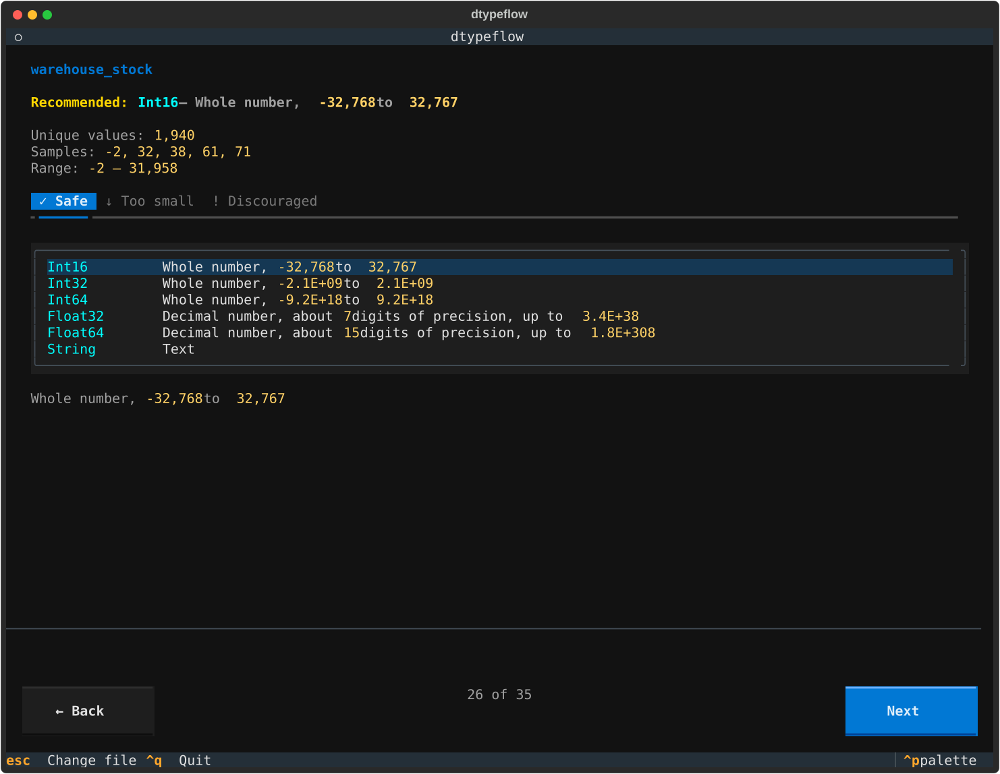
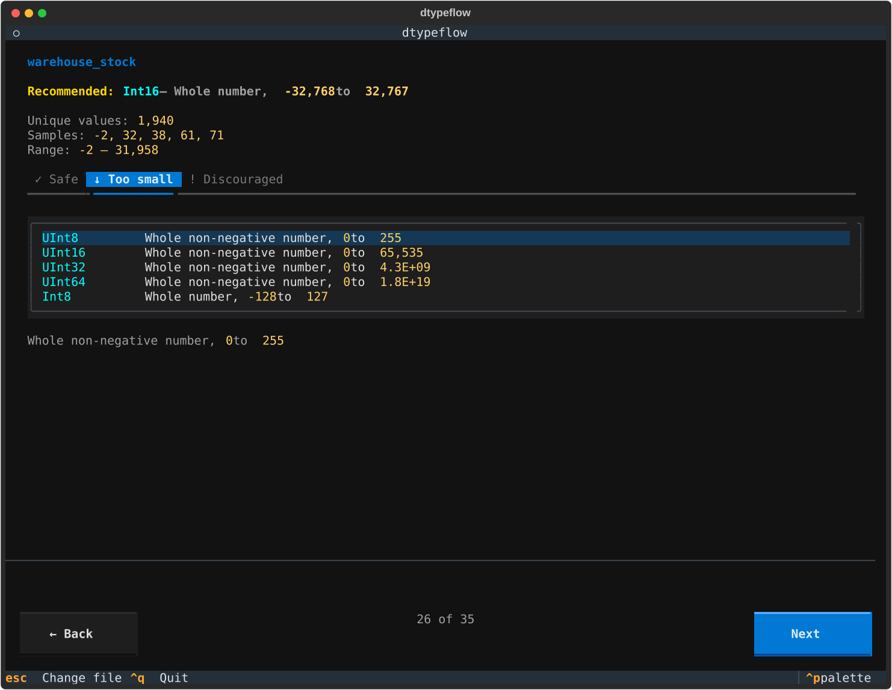
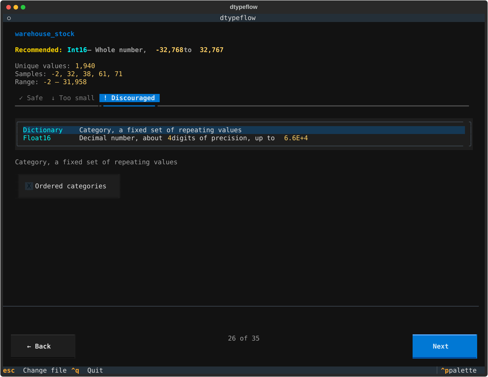

# dtypeflow

[](https://pypi.org/project/dtypeflow/)
[](https://pypi.org/project/dtypeflow/)
[](https://pepy.tech/project/dtypeflow)
[](https://pypi.org/project/dtypeflow/)

`dtypeflow` is a terminal UI to convert a CSV file to Parquet.

Point it at a CSV file, and for each column it infers the tightest-fitting
dtype (`Boolean`, unsigned/signed integers `UInt8`…`UInt64`/`Int8`…`Int64`,
floats `Float16`/`Float32`/`Float64`, `String`, or `Dictionary`), shows the
observed statistics, and lets you review or override the choice before
writing the result to Parquet — all locally, no data leaves your machine.

## Installation

```bash
uv tool install dtypeflow
```

Or with `pipx`:

```bash
pipx install dtypeflow
```

Or with `pip`:

```bash
pip install dtypeflow
```

## Usage

Launch the picker and choose a CSV file interactively:

```bash
dtypeflow
```

Or pass a path directly to skip straight to configuring column types:

```bash
dtypeflow path/to/data.csv
```

The workflow has three steps:

1. **Pick a file** — enter or browse for a CSV path.
2. **Configure types** — for each column, review the recommended dtype, its
   stats (unique values, samples, range/precision/scale), and pick from
   compatible alternatives grouped by safety (Safe / Too small / Discouraged).
3. **Export** — write the configured dataset to a Parquet file.

### Screenshots

Alternatives for a column are grouped by how safe they are to apply:

<table>
<tr>
<td align="center"><b>Safe</b></td>
<td align="center"><b>Too small</b></td>
<td align="center"><b>Discouraged</b></td>
</tr>
<tr>
<td></td>
<td></td>
<td></td>
</tr>
</table>

## Development

This project uses [uv](https://docs.astral.sh/uv/) for dependency management.

```bash
uv sync
uv run dtypeflow
```

Lint:

```bash
uv run --with ruff ruff check src/
```

## License

[MIT](LICENSE)
